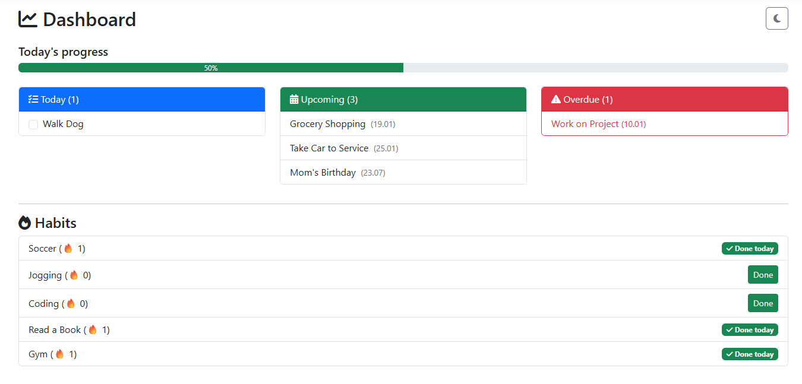
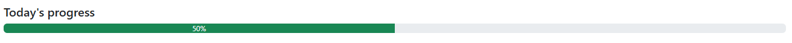
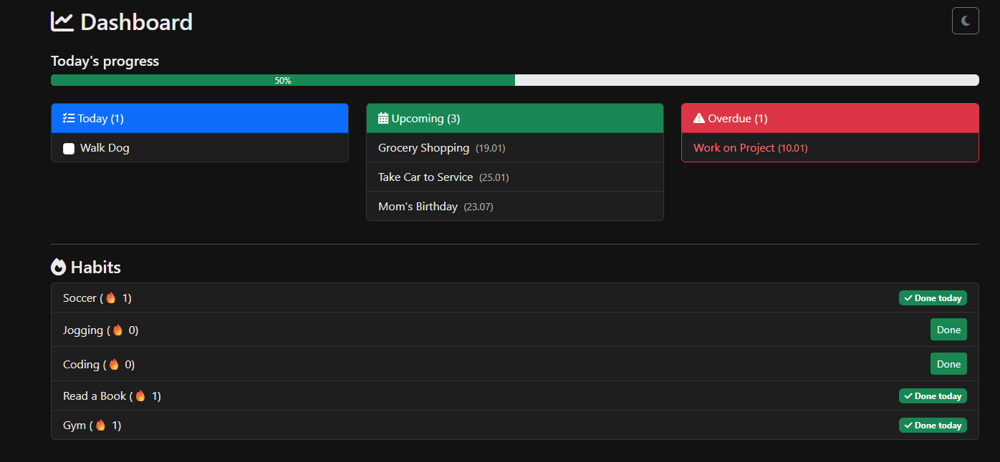

# Productivity Dashboard (ASP.NET Core MVC)

A simple but production-style productivity web application built with **ASP.NET Core MVC** and **Entity Framework Core**.

The app focuses on **daily task management and habit tracking**, with a clean dashboard that visualizes progress and priorities.

---

## ✨ Features

### 📊 Dashboard

* **Today / Upcoming / Overdue** task sections
* Inline task completion using checkboxes
* Animated daily progress bar
* Clear visual prioritization

### ✅ Tasks

* Create, edit, delete tasks
* Due date support
* Mark tasks as completed directly from dashboard

### 🔁 Habits

* Habit list with streak tracking
* One-click daily completion

### 🧠 Smart Logic

* SQLite-safe date filtering (range-based queries)
* Progress calculated from source-of-truth data
* Clean separation using ViewModels

---

## 🛠️ Tech Stack

* **ASP.NET Core MVC**
* **Entity Framework Core**
* **SQLite**
* **Bootstrap 5**
* **Razor Views**

---

## 📸 Screenshots

> Dashboard (Light mode)



> Task progress visualization



> Dashboard (Dark mode)



---

## 🚀 Getting Started

```bash
git clone https://github.com/Shudor/productivity-dashboard.git
cd productivity-dashboard
dotnet restore
dotnet ef database update
dotnet run
```

Open browser at:

```
https://localhost:5001
```

---

## 🧪 Lessons Learned

* Handling DateTime correctly with SQLite and EF Core
* Avoiding logic coupling between UI filters and statistics
* Building interactive UX with pure MVC and minimal JavaScript

---

## 📌 Future Improvements

* User authentication (ASP.NET Identity)
* Weekly/monthly statistics
* API layer for SPA or mobile frontend

---

## 👤 Author

Built as a **portfolio project** to demonstrate practical ASP.NET Core MVC skills.

---

⭐ If you like this project, feel free to star the repository!
